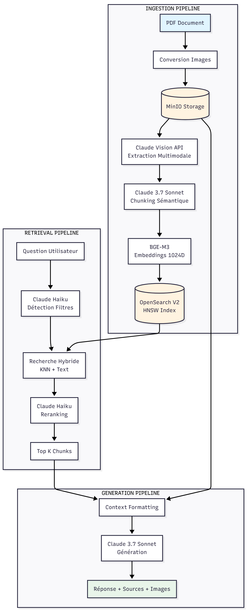

# Seet — Multimodal Financial Document Intelligence

<div align="center">


**An end-to-end multimodal RAG system for intelligent financial report analysis — built for and deployed at [Sonatel](https://www.sonatel.sn), West Africa's leading telecommunications group.**

*"Seet" (ꜱᴇᴇᴛ) — from Wolof, meaning "to search"*

</div>

---

## Context & Motivation

This project was commissioned by the **Human Resources and Finance Division of Sonatel** (Orange Senegal) during an engineering internship. The challenge: Sonatel's financial analysts and HR teams needed to query complex PDF reports — full of tables, charts, and mixed-language content — without manually reading hundreds of pages each quarter.

Seet RAG solves this by combining **multimodal document understanding** (Claude Vision), **semantic search** (BGE-M3 + OpenSearch hybrid), and **LLM-powered answer generation** (Claude 3.7 Sonnet) into a single, production-ready conversational interface.

The system was evaluated against real Sonatel financial reports from 2023–2025 and achieved a **global RAGAS score of 84.4%**, with a perfect context recall of 100%.

---

## Key Features

- **Multimodal PDF ingestion** — converts PDF pages to images, then uses Claude Vision to extract text, tables, charts, and figures with full semantic understanding
- **Intelligent semantic chunking** — Claude 3.7 Sonnet segments extracted content into coherent, self-contained chunks, preserving financial data integrity across table rows and multi-page figures
- **1024-dimension vector embeddings** — BGE-M3, a multilingual embedding model optimised for retrieval, encodes each chunk and stores it in OpenSearch using the HNSW algorithm
- **Hybrid search with automatic temporal filtering** — combines dense vector similarity and BM25 text search; Claude Haiku automatically detects and applies time-period filters (e.g. "Q1 2024", "fiscal year 2023") from the user's query
- **LLM reranking** — Claude Haiku re-scores retrieved chunks for relevance before passing them to the generator, improving answer precision
- **Cited, image-grounded answers** — every response includes source references (file, page, section, period) and the corresponding page images stored in MinIO
- **RAGAS-evaluated quality** — automated evaluation pipeline measuring Context Precision, Recall, Faithfulness, and Answer Relevancy

---

## Architecture



The system is built around three sequential pipelines:

### 1 — Ingestion Pipeline

```
PDF file
   │
   ▼
pdf_to_images.py          → Converts each PDF page to a PNG image (via Poppler)
   │
   ▼
minio_manager.py          → Uploads images to MinIO, organised as:
                             {org}/{year}/{period}/{document}/page_{n}.png
   │
   ▼
multimodal_extractor.py   → For each image, calls Claude Vision API with a
                             structured prompt to extract:
                               • Raw text content
                               • Tables (as structured data)
                               • Charts and figures (described semantically)
                               • Section headers and metadata
   │
   ▼
semantic_chunker.py       → Sends extracted text to Claude 3.7 Sonnet, which
                             identifies logical chunk boundaries and produces
                             self-contained, labelled segments with:
                               • Section type (financial KPI / narrative / table)
                               • Temporal scope (year, quarter, semester)
                               • Title and summary
   │
   ▼
embedding_generator.py    → Encodes each chunk with BGE-M3 (BAAI/bge-m3)
                             → 1024-dimensional dense vector per chunk
   │
   ▼
opensearch_indexer.py     → Indexes chunks into OpenSearch (index: rag-documents-v2)
                             with both the dense vector (knn_vector field, HNSW)
                             and the raw text (for BM25), plus all metadata fields
```

### 2 — Retrieval Pipeline

```
User query (natural language)
   │
   ▼
opensearch_retriever.py
   ├── Claude Haiku analyses the query to extract:
   │     • Temporal filters (year, quarter, semester)
   │     • Document type hints
   │
   ├── Hybrid search:
   │     • Dense KNN search on the 1024-dim vector space
   │     • BM25 full-text search with French-language analyser
   │     • Scores combined with weighted fusion
   │
   └── Returns top-N candidate chunks with metadata + MinIO image URLs
   │
   ▼
reranker.py
   └── Claude Haiku scores each candidate against the query
       → Returns top-K most relevant chunks (default K=5)
```

### 3 — Generation Pipeline

```
Top-K chunks + MinIO image URLs
   │
   ▼
response_generator.py
   ├── Formats a structured context block from chunks
   ├── Fetches and base64-encodes referenced page images from MinIO
   ├── Calls Claude 3.7 Sonnet with:
   │     • System prompt defining financial analyst persona
   │     • Structured context (text + images)
   │     • User query
   │
   └── Parses the response to extract:
         • Main answer text
         • Source citations (file / page / section / period)
         • Images referenced in the answer
   │
   ▼
app_streamlit.py
   └── Renders answer, sources, and images in the Streamlit UI
```

---

## Tech Stack

| Layer | Technology | Role |
|---|---|---|
| **LLM** | Claude 3.7 Sonnet | Multimodal extraction, semantic chunking, answer generation |
| **LLM (lightweight)** | Claude Haiku | Query filter detection, chunk reranking |
| **LLM (evaluation)** | Claude Sonnet 4 | RAGAS judge model |
| **Embeddings** | BGE-M3 (`BAAI/bge-m3`) | 1024-dim multilingual dense vectors |
| **Vector DB** | OpenSearch 2.11 | Hybrid search (HNSW KNN + BM25), French analyser |
| **Object storage** | MinIO | PDF page images, hierarchical organisation |
| **UI** | Streamlit 1.50 | Conversational web interface |
| **Evaluation** | RAGAS 0.3.6 | Automated RAG quality metrics |
| **PDF processing** | PyMuPDF + Poppler | PDF → image conversion |
| **Orchestration** | Docker Compose | OpenSearch + MinIO service stack |
| **Language** | Python 3.11 | — |

---

## Evaluation Results

The system was evaluated on a curated dataset of **10 questions** spanning financial and operational data from three Sonatel reports:
- Annual consolidated results — FY 2023
- Activity report — Q1 2024
- Activity report — H1 2025

### RAGAS Scores

```
RETRIEVAL QUALITY
├── Context Precision   0.850 / 1.000   ██████████████████░░  Very good
├── Context Recall      1.000 / 1.000   ████████████████████  Perfect
└── Retrieval Score     0.925 / 1.000   ██████████████████░░  Excellent

GENERATION QUALITY
├── Faithfulness        0.632 / 1.000   ████████████░░░░░░░░  Good
├── Answer Relevancy    0.893 / 1.000   █████████████████░░░  Very good
└── Generation Score    0.762 / 1.000   ███████████████░░░░░  Good

GLOBAL SCORE          0.844 / 1.000   ████████████████░░░░  Excellent
```

**Interpretation:**

The **perfect Context Recall (1.0)** confirms that the hybrid search + HNSW indexing strategy never misses a relevant document — every piece of information needed to answer the query is present in the retrieved context. The **high Context Precision (0.850)** shows that the reranking step successfully filters out noise before generation.

The **Faithfulness score (0.632)** reflects Claude's tendency to synthesise and paraphrase across multiple sources rather than quote verbatim — a characteristic of generative models that can be mitigated with stricter prompting or a citation-extraction post-processing step (planned for v2).

**Overall: 84.4% global RAGAS score → rated "Excellent" for a production RAG system.**

---

## Project Structure

```
seet-rag-financial-app/
├── app_streamlit.py                      # Streamlit web interface
├── docker-compose.yml                    # OpenSearch + MinIO services
├── make_bucket_public.py                 # MinIO bucket policy setup
├── migrate_opensearch.py                 # Index schema migration (V1 → V2)
├── test_claude_connection.py             # Anthropic API connectivity test
├── test_imports.py                       # Dependency check
├── requirements.txt                      # Python dependencies
├── .env.example                          # Environment variable template
│
├── src/
│   ├── ingestion/
│   │   ├── pdf_to_images.py              # PDF page → PNG conversion (Poppler)
│   │   ├── minio_manager.py              # MinIO upload / URL generation
│   │   ├── multimodal_extractor.py       # Claude Vision extraction per page
│   │   ├── semantic_chunker.py           # Claude-powered semantic segmentation
│   │   ├── embedding_generator.py        # BGE-M3 vector encoding
│   │   └── opensearch_indexer.py         # Hybrid index creation & bulk insert
│   │
│   ├── retrieval/
│   │   ├── opensearch_retriever.py       # Hybrid KNN + BM25 + temporal filters
│   │   └── reranker.py                   # Claude Haiku relevance reranking
│   │
│   └── generation/
│       └── response_generator.py         # Context formatting + Claude generation
│
├── tests/
│   ├── evaluation_dataset.json           # 10 gold Q&A pairs (FR/EN)
│   ├── run_evaluation.py                 # Generates system answers for each question
│   ├── evaluation_results.json           # Raw system outputs
│   ├── run_ragas_evaluation.py           # Computes RAGAS metrics via Claude judge
│   └── ragas_scores.json                 # Final RAGAS scores
│
├── data/
│   └── processed/
│       └── extractions_minio/            # Per-document extracted text (page-by-page)
│
└── docs/
    └── images/
        └── Architecture_RAG_Financial_App.png
```

---

## Prerequisites

| Requirement | Version | Notes |
|---|---|---|
| Python | 3.11 | Conda environment recommended |
| Docker Desktop | Latest | For OpenSearch + MinIO |
| Poppler | Any recent | PDF → image conversion |
| Anthropic API key | — | [Get one here](https://console.anthropic.com) |

### Install Poppler

**macOS:**
```bash
brew install poppler
```

**Ubuntu / Debian:**
```bash
sudo apt-get install poppler-utils
```

**Windows:** Download from [oschwartz10612/poppler-windows](https://github.com/oschwartz10612/poppler-windows/releases), extract to `C:\Program Files\poppler`, and add `C:\Program Files\poppler\Library\bin` to your system PATH. Verify with `pdftoppm -v`.

---

## Installation & Setup

### Option A — Docker Compose (recommended)

Docker handles OpenSearch and MinIO automatically. Only Python runs on your host.

```bash
# 1. Clone the repository
git clone https://github.com/thiernodaoudaly/seet-rag-financial-app.git
cd seet-rag-financial-app

# 2. Create a Python environment
conda create -n seet-rag python=3.11
conda activate seet-rag

# 3. Install Python dependencies
pip install -r requirements.txt

# 4. Configure environment variables
cp .env.example .env
# Edit .env and set your ANTHROPIC_API_KEY

# 5. Start infrastructure services
docker compose up -d

# 6. Verify all three containers are running
docker compose ps
#   opensearch-rag          → port 9200
#   opensearch-dashboards-rag → port 5601
#   minio-rag               → ports 9000, 9001

# 7. Initialise the MinIO bucket (run once)
python make_bucket_public.py

# 8. Verify your Anthropic API connection
python test_claude_connection.py

# 9. Launch the application
streamlit run app_streamlit.py
# → Open http://localhost:8501
```

### Option B — Without Docker

If Docker is not available, install OpenSearch and MinIO directly on your machine. Follow the detailed platform-specific instructions below.

<details>
<summary><strong>OpenSearch — Windows</strong></summary>

1. Download OpenSearch 2.11.0 (Windows `.zip`) from [opensearch.org/downloads](https://opensearch.org/downloads.html)
2. Extract to `C:\opensearch-2.11.0`
3. Edit `C:\opensearch-2.11.0\config\opensearch.yml`:

```yaml
plugins.security.disabled: true
network.host: 0.0.0.0
http.port: 9200
discovery.type: single-node
```

4. Edit `C:\opensearch-2.11.0\config\jvm.options` and set:

```
-Xms512m
-Xmx512m
```

5. Start: `cd C:\opensearch-2.11.0\bin && .\opensearch.bat`
6. Verify: open `http://localhost:9200` in a browser

</details>

<details>
<summary><strong>OpenSearch — Ubuntu / Debian</strong></summary>

```bash
curl -o- https://artifacts.opensearch.org/publickeys/opensearch.pgp \
  | sudo gpg --dearmor --batch --yes -o /usr/share/keyrings/opensearch-keyring

echo "deb [signed-by=/usr/share/keyrings/opensearch-keyring] \
  https://artifacts.opensearch.org/releases/bundle/opensearch/2.x/apt stable main" \
  | sudo tee /etc/apt/sources.list.d/opensearch-2.x.list

sudo apt-get update && sudo apt-get install opensearch=2.11.0

# Required: raise vm.max_map_count for OpenSearch
echo "vm.max_map_count=262144" | sudo tee -a /etc/sysctl.conf
sudo sysctl -p

# Configure
sudo nano /etc/opensearch/opensearch.yml
# Add: plugins.security.disabled: true / network.host: 0.0.0.0 / discovery.type: single-node

sudo systemctl start opensearch && sudo systemctl enable opensearch
curl http://localhost:9200  # verify
```

</details>

<details>
<summary><strong>OpenSearch — macOS</strong></summary>

```bash
brew tap opensearch-project/opensearch
brew install opensearch

# Edit config
nano /usr/local/etc/opensearch/opensearch.yml
# Add: plugins.security.disabled: true / network.host: 0.0.0.0 / discovery.type: single-node

sudo sysctl -w vm.max_map_count=262144
brew services start opensearch
curl http://localhost:9200  # verify
```

</details>

<details>
<summary><strong>MinIO — all platforms</strong></summary>

**Windows:** Download `minio.exe` from [min.io/download](https://min.io/download). Create `C:\minio\data`, then run:
```batch
set MINIO_ROOT_USER=minioadmin
set MINIO_ROOT_PASSWORD=minioadmin
minio.exe server C:\minio\data --console-address ":9001"
```

**Linux:**
```bash
wget https://dl.min.io/server/minio/release/linux-amd64/minio
chmod +x minio && sudo mv minio /usr/local/bin/
sudo mkdir -p /data/minio
MINIO_ROOT_USER=minioadmin MINIO_ROOT_PASSWORD=minioadmin \
  minio server /data/minio --console-address ":9001"
```

**macOS:**
```bash
brew install minio/stable/minio
MINIO_ROOT_USER=minioadmin MINIO_ROOT_PASSWORD=minioadmin \
  minio server ~/minio/data --console-address ":9001"
```

Console available at `http://localhost:9001` (minioadmin / minioadmin).

</details>

After installing OpenSearch and MinIO manually, follow steps 1–4 and 7–9 from Option A (skip step 5 and 6).

---

## Configuration

Copy `.env.example` to `.env` and fill in your values:

```env
# Required
ANTHROPIC_API_KEY=sk-ant-...

# MinIO (default values match docker-compose.yml)
MINIO_ENDPOINT=localhost:9000
MINIO_ACCESS_KEY=minioadmin
MINIO_SECRET_KEY=minioadmin
```

> The `DATABASE_URL` for OpenSearch is currently hardcoded to `localhost:9200`. To point to a remote cluster, update the `host` and `port` parameters in `src/retrieval/opensearch_retriever.py` and `src/ingestion/opensearch_indexer.py`.

---

## Using the Application

Once running at `http://localhost:8501`:

### Step 1 — Index a document

1. Click **"Choose a PDF file"** in the sidebar
2. Select a financial report (PDF format)
3. Click **"Index"**
4. Monitor progress through each stage:
   - Metadata extraction
   - Page-to-image conversion
   - Claude Vision multimodal extraction
   - Semantic chunking
   - BGE-M3 embedding generation
   - OpenSearch indexing

Processing time depends on document length — typically 1–3 minutes per 10-page document.

### Step 2 — Ask questions

Use natural language. The system handles both French and English and automatically detects temporal scope.

**Financial KPIs:**
```
What is the consolidated revenue for H1 2025?
What was the EBITDAAL in Q1 2024?
What is the net income for fiscal year 2023?
```

**Operational metrics:**
```
How many mobile customers does Sonatel have as of H1 2025?
What is the active 4G subscriber base in Q1 2024?
How many fibre customers in 2025?
```

**Cross-document comparisons:**
```
Compare H1 2025 results with H1 2024.
What is the revenue growth trend from 2023 to 2025?
```

### Step 3 — Explore sources

Each answer includes:
- **Source citations** — document name, page number, section, content type, time period
- **Page images** — the actual PDF page images fetched from MinIO for visual verification
- Click **"View sources"** to expand the citation panel

### Step 4 — Browse indexed data

The sidebar's **"Available data"** section shows:
- Indexed file names
- Years and periods covered
- Document types available

---

## Running the Evaluation

The evaluation pipeline measures system quality against a gold dataset of 10 question–answer pairs built from Sonatel's 2023–2025 reports.

```bash
# Step 1: Generate system answers for all 10 questions
python tests/run_evaluation.py
# → Saves results to tests/evaluation_results.json

# Step 2: Compute RAGAS metrics using Claude Sonnet 4 as judge
python tests/run_ragas_evaluation.py
# → Saves scores to tests/ragas_scores.json
```

**Metrics computed:**

| Metric | What it measures |
|---|---|
| Context Precision | Are the retrieved chunks relevant? (no noise) |
| Context Recall | Are all necessary chunks retrieved? (no omissions) |
| Faithfulness | Is the answer grounded in the retrieved context? |
| Answer Relevancy | Does the answer actually address the question? |

Scores range from 0.0 to 1.0. See [Evaluation Results](#-evaluation-results) for the current baseline.

---

## Troubleshooting

### OpenSearch container won't start

```bash
docker logs opensearch-rag
# If you see memory errors, increase Docker's memory allocation in Docker Desktop settings (≥4GB recommended)
# Or reduce JVM heap in docker-compose.yml:
# OPENSEARCH_JAVA_OPTS=-Xms256m -Xmx256m
```

### MinIO images not loading in the UI

```bash
# Re-run the bucket policy script
python make_bucket_public.py

# Check MinIO logs
docker logs minio-rag
```

### "Poppler not found" error

```bash
# Verify Poppler is in your PATH
pdftoppm -v

# If not found, check your OS-specific installation above
# On Windows, restart your terminal after editing PATH
```

### Anthropic API error

```bash
# Test connectivity and key validity
python test_claude_connection.py

# Ensure ANTHROPIC_API_KEY is set in your .env file and not expired
```

### BGE-M3 memory error

If your machine has limited RAM, reduce the embedding batch size in `src/ingestion/embedding_generator.py`:

```python
# Change batch_size from 32 to 8
self.model.encode(texts, batch_size=8, device='cpu')
```

### Port conflicts

```bash
# Check which process is using a port
# Linux / macOS
lsof -i :9200

# Windows
netstat -ano | findstr :9200

# Kill the process or change the port in docker-compose.yml
```

---

## Roadmap

- [ ] Add DELETE and UPDATE routes for indexed documents
- [ ] Improve Faithfulness score with stricter citation-extraction prompting
- [ ] Support multi-document cross-reference queries
- [ ] Add a Gradio or FastAPI interface as an alternative to Streamlit
- [ ] Publish pre-built Docker image to Docker Hub
- [ ] Add GitHub Actions CI for automated RAGAS regression testing

---

## Contributors

**Astou DIALLO · Cheikh Marie Teuw DIOP · Thierno Daouda LY**

Built during an engineering internship at **Sonatel** (Orange Senegal), in response to a real business need from the HR and Finance Division.

---

## License

This project is released under the MIT License. It integrates the following third-party services and libraries, each governed by their own licence:
- **Claude API** — [Anthropic Terms of Service](https://www.anthropic.com/legal/aup)
- **OpenSearch** — Apache 2.0
- **MinIO** — GNU AGPL v3
- **BGE-M3** — MIT
- **RAGAS** — Apache 2.0

---
